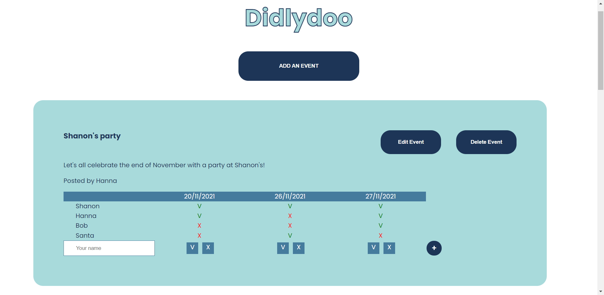

# Didlydoo

An event planner made by [Shanon](https://github.com/shanon-richet) and [Hanna](https://github.com/hanjika). This project uses a ready-made API and methods GET, POST, PATCH and DELETE.

*Can only be viewed on github-pages if the repository is cloned and the server is running.*

### Preview

